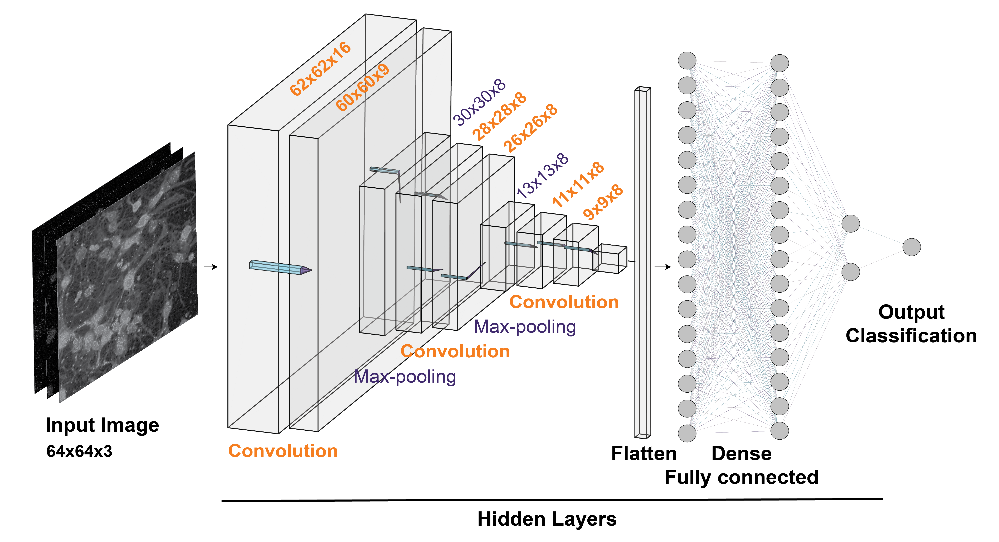

# CNN model to classify microscopy images
A VGG16 based keras model to classify microscopy images of neural precursor cells or neurons with 2 or 3 imaging channels.
This model was trained and tested using iPSC derived neural precursor cells and neurons modeling Parkinson's Disease. 

   

This repository contains:
1. Scripts for data processing
2. Scripts to build the initial model.
3. Scripts to train the model.
4. Scripts to test (predict) the disease status of images using the model.
5. Models saved from experiments comparing models of PD with controls and various model conditions.

# Usage instructions

Run the bash script docker_run.sh located in the docker_env folder.

This script builds the image, creates the container and executes the container. You may specify the name of the container and the export location inside the bash script on the "docker run" line.
The ouput files will be saved within the export location specified.

To modifer the type of model, training data, or test data used, you may modify the run_cnn.sh bash script

This script is run when the container is executed.

These two commented out lines create the shape of the CNN: that hasn't been trained at all (empty structure)

> python /developer/create_model_original.py
> python /developer/create_model_categorical.py

All models will be created in the data_models/models folder

The following example line trains a model.

> python /developer/train_model.py model_original AIW-ParkinKO AIW-ParkinKO model_test_Aug9_2022 --epoch 5

There are four mandatory arguments - You can get the list of variables  with > python train_model.py --help

1. name of the starting model before training (model_original, transfer_model, model_categorical)

2. trainset_name = the name of the folder for the training set must be inside the folder data/

You can enter a list of training for validation data and you enter this separated by comma no space
Example: Batch1,Batch2,Batch3

3. validation set name = usually the same unless you want see how the model does on another dataset during the training

4. name of the model = what the model will be called when it is saved

There are also additional optional arguments for epoch, set size

You can test the trained model with this for the binary classifier
> python /developer/test_model.py model_test_Aug9_2022 AIW-ParkinKO
1. name of trained model
2. test data folder - you cannot enter multiple tests here yet.

This is for testing the categorical model
> python /developer/test_model_categorical.py model_test_Aug9_2022 AIW-ParkinKO

All test resuls will be saved within the data_model/models folder
